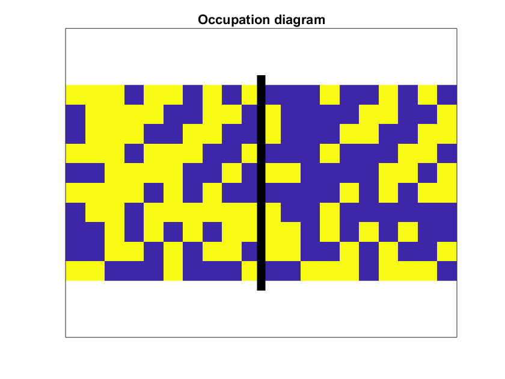
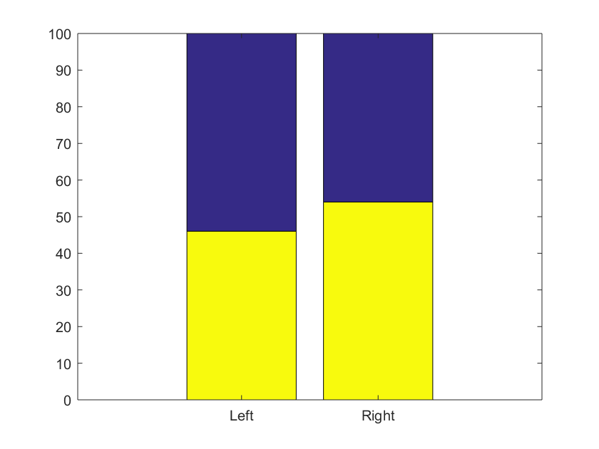
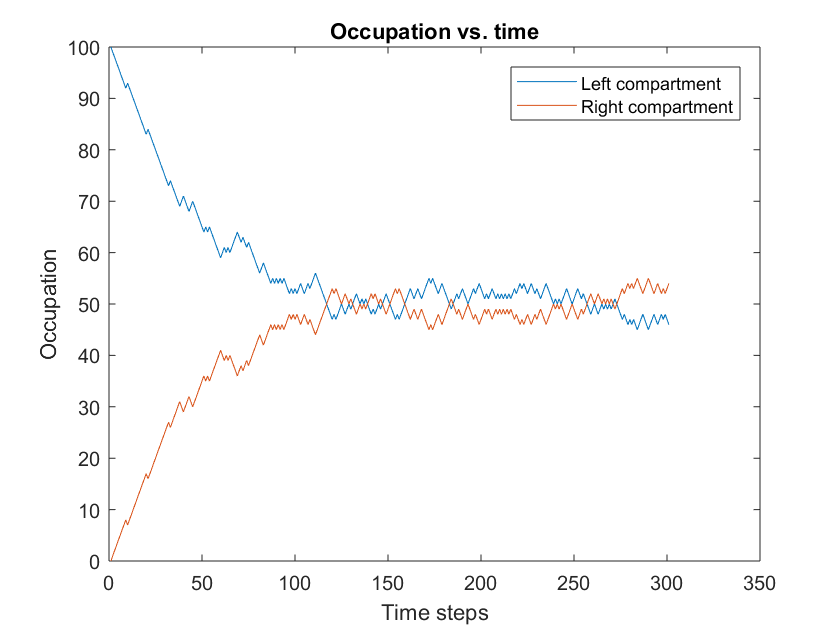
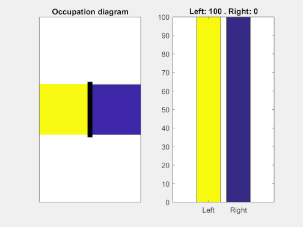

# SimpleExpansion
A simple model for free expansion of a gas using stochastic dynamics

## Background
The main purpose of this piece of code is simulating the free expansion of a gas (https://en.wikipedia.org/wiki/Free_expansion).

Here we use a minimal discrete time model. We initialize it with all the molecules in the left cavity. At each time step, one particle chosen randomly changes its position to the other cavity.Even with such a simple dynamics, several properties of free expansion can be derived.

The main purpose of this code is the generation of animated visualizations, useful for teaching basic statistical mechanics.

Where the value of the potential at x_0 is an arbitrary integration constant.

## Examples of usage
### Create and update the ExpansionSim object
```[Matlab]
%% Initialization
r = 10; % Number of rows
c = 10; % Number of columns

%% Create the object
obj = ExpansionSim(r, c);

%% Update N times
N = 100;
obj.Update(N);
```

### Plot occupation diagram
```[Matlab]
obj.Plot(); % Plots current occupation diagram

obj.Plot(tStep); % Plots the occupation diagram at a given time step
```



### Plot a summary of the occupation as a bar plot
```[Matlab]
obj.PlotBar(); % Bar plot of the current occupation summary

obj.Plot(tStep); % Bar plot of the occupation summary at a given time step
```



### Plot historic summary of occupation
```[Matlab]
obj.PlotHistoric();
```



### Create an animated occupation diagram
```[Matlab]
obj.Animate();
```



By [Pablo Rodríguez-Sánchez](https://sites.google.com/site/pablorodriguezsanchez/ "Contact"), November 2017.
